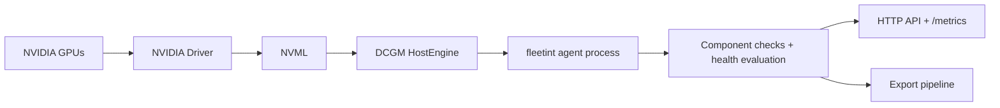
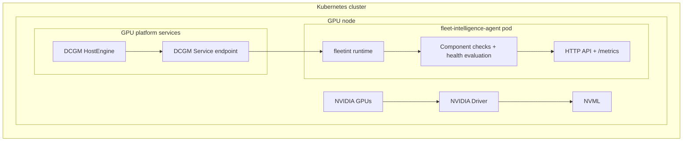
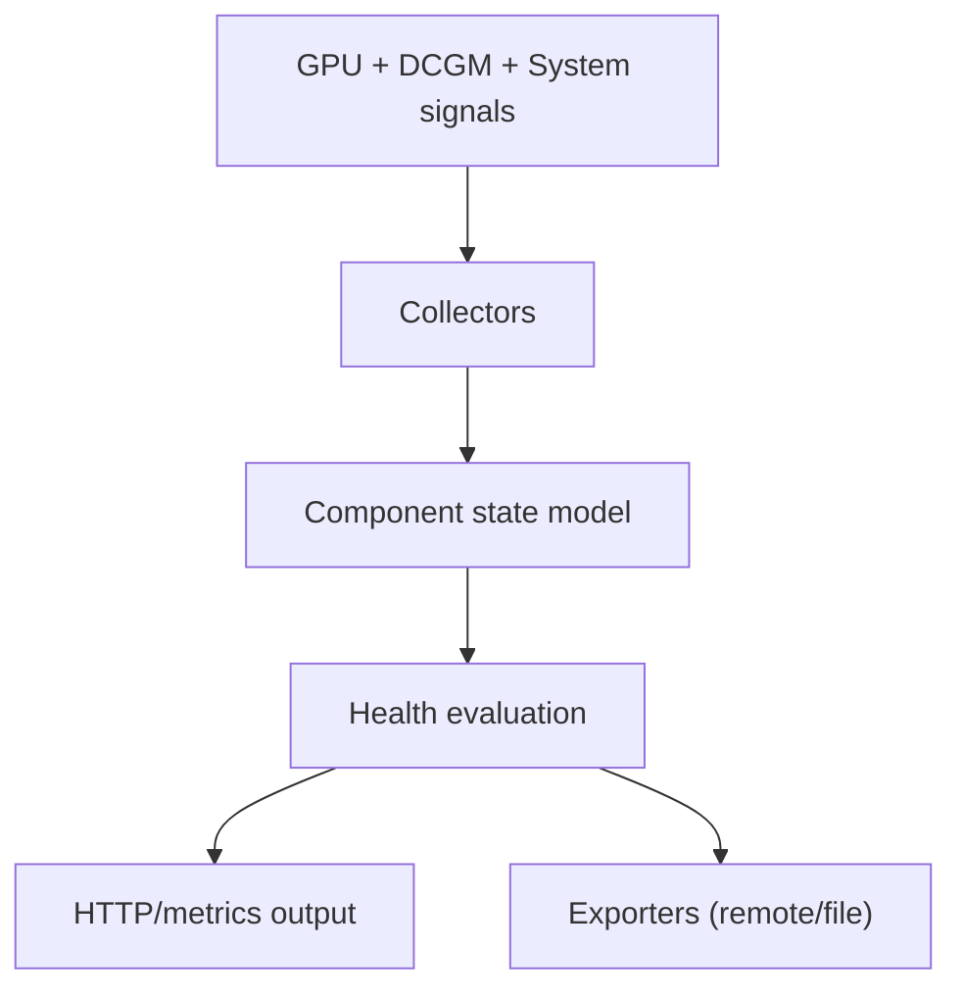

# Architecture

This document explains how the Fleet Intelligence Agent works at runtime on bare metal and Kubernetes.

## Agent runtime model

At runtime, the agent follows a consistent pipeline:

1. Discover available components (GPU/DCGM and system-level checks).
2. Collect telemetry and health signals.
3. Evaluate component health and status.
4. Publish results through:
   - HTTP API
   - Prometheus metrics endpoint (`/metrics`)
   - Optional remote export
   - Optional local file export

## Bare metal runtime architecture

On bare metal, the agent runs directly on the host and talks to local NVIDIA stack dependencies.

### Dependency graph

### Runtime behavior

- GPU/DCGM components read health and telemetry from DCGM/NVML-backed data paths.
- System components read host state (CPU, memory, disk, network, OS/kernel/library/PCI views).
- The agent evaluates component health continuously and serves current state via API/metrics.
- Exporters serialize telemetry/events/health data for downstream ingestion.

## Kubernetes runtime architecture

In Kubernetes, the same agent runtime executes inside a pod (typically one pod per GPU node).

### Dependency graph

### Runtime behavior

- Agent component logic is the same as bare metal.
- DCGM-backed components consume DCGM over the cluster endpoint (`DCGM_URL`).
- The pod reads required host-level views through mounted paths and runtime-provided device access.
- Health evaluation and export behavior remain identical to host mode.

## Data flow inside the agent

## Dependency and failure behavior

- If DCGM is unavailable, DCGM-backed GPU components degrade while non-DCGM components can continue.
- If GPU runtime/device access is unavailable in Kubernetes, GPU-facing checks may fail or report degraded state.
- If upstream signals recover, component health transitions back based on normal collection/evaluation cycles.
