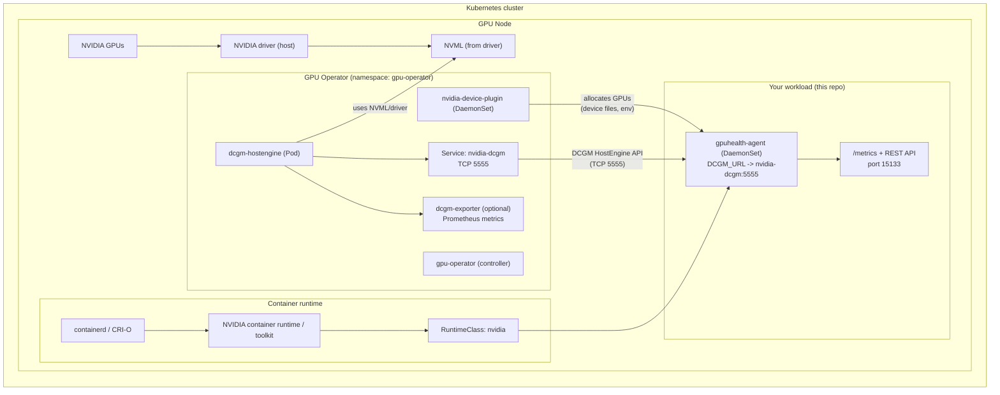

# Deployment Overview

This document explains how `gpuhealth` runs on bare metal and in Kubernetes, and
how it depends on NVIDIA DCGM for GPU telemetry.

## Bare metal (packages/binary)

On bare metal, the agent runs directly on the host and uses DCGM installed from
the NVIDIA CUDA repository. The package install flow sets up a systemd service
(`gpuhealthd`) that runs the `gpuhealth` binary, and configuration is provided
via `/etc/default/gpuhealth`.

Key points:

- DCGM is installed from the CUDA repo as a dependency of the package install.
- The agent runs on the host and accesses local NVIDIA drivers and DCGM.
- You can change flags like `--log-level` via `GPUHEALTH_FLAGS` in
  `/etc/default/gpuhealth`.

## Kubernetes: DCGM dependency diagram

The GPU Health Agent is deployed via a Helm chart published in NGC (source lives
in `deployments/helm/gpuhealth-agent`). The agent does not deploy DCGM itself; it
expects DCGM HostEngine to already be running in the cluster (most commonly via
the NVIDIA GPU Operator). For install steps, see `docs/install-helm.md`.

In the DaemonSet/Helm chart, this is configured via:

- `DCGM_URL=nvidia-dcgm.gpu-operator.svc:5555`

### Important: install GPU Operator with DCGM HostEngine enabled

To make sure DCGM is deployed as a separate HostEngine pod + Service (so other
workloads can connect to it over the network), install NVIDIA GPU Operator with:

- `dcgm.enabled=true`

If `dcgm.enabled` is not set to true, DCGM may run only embedded inside
`dcgm-exporter`, and you may not get a standalone `nvidia-dcgm` Service for
`gpuhealth-agent` to talk to via `DCGM_URL`.

### Dependency diagram (DCGM in K8s)



## What this means operationally

- GPU Operator provides DCGM: when you install NVIDIA GPU Operator, it typically
  deploys the DCGM HostEngine pod and exposes it via the `nvidia-dcgm` Service on
  port `5555` in the `gpu-operator` namespace.
- `gpuhealth-agent` consumes DCGM: `gpuhealth-agent` talks to DCGM over the
  cluster network using `DCGM_URL`. If DCGM is missing or unreachable,
  DCGM-backed components will fail or be degraded.
- RuntimeClass must exist: the DaemonSet uses `runtimeClassName: nvidia`, which
  is usually created by the GPU Operator or NVIDIA runtime tooling.

## Quick checks

```bash
# DCGM HostEngine + Service (names may vary slightly by GPU Operator version/config)
kubectl get pods,svc -n gpu-operator | egrep 'dcgm|nvidia-dcgm'

# Verify the service and port
kubectl -n gpu-operator get svc nvidia-dcgm
```
